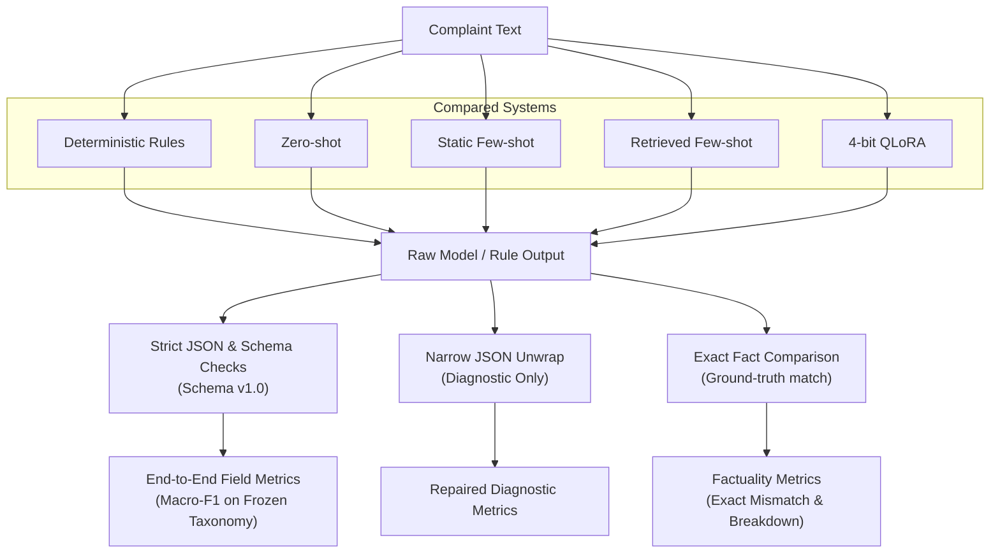
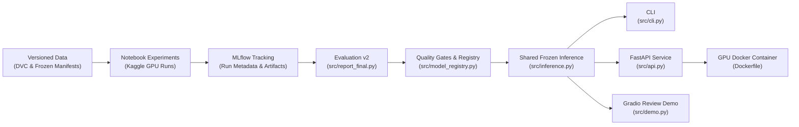

# CivicStruct

**Turning informal civic complaints into validated structured JSON using fine-tuned small language models.**

[](https://www.python.org/)
[](https://huggingface.co/HuggingFaceTB/SmolLM3-3B)
[]()
[](data/final_results/README.md)
[](https://goyashek-civicstruct-grievance-demo.hf.space/)
[](dvc.lock)
[](data/reproducibility_results/mlruns)

[Try Live Demo](https://goyashek-civicstruct-grievance-demo.hf.space/) · [Final Results Report](data/final_results/README.md) · [System Architecture](docs/architecture.svg) · [Quickstart & Reproduction](#reproducing-the-saved-results)

---

> [!NOTE]
> **Central Research Question**
>
> Can a small language model turn an informal civic complaint into reliable structured data, and does QLoRA fine-tuning earn its complexity over deterministic rules and few-shot prompting?

The final QLoRA system was the strongest learned approach on the frozen 50-complaint test set. It reached **0.940** strict schema validity, **0.829** domain F1, **0.745** issue F1, and **0.670** missing-information F1.

That result is useful, but incomplete. Deterministic rules still reached **0.883** domain F1, and QLoRA had a **0.365** exact factual-field mismatch rate. Valid JSON does not automatically mean reliable fact extraction.

---

## At a glance

| Component | Choice / Metric |
|:---|:---|
| **Task** | Civic complaint to validated, schema-constrained JSON |
| **Base Model** | `HuggingFaceTB/SmolLM3-3B` |
| **Adaptation** | 4-bit QLoRA (NF4, rank 16, alpha 32, cosine schedule) |
| **Training Data** | 120 controlled and 40 deidentified public complaints (160 rows total) |
| **Compared Systems** | Deterministic rules, zero-shot, static few-shot, retrieved few-shot, QLoRA |
| **Final Evaluation** | 50 frozen internal complaints (Evaluation v2) |
| **Public Review** | Live Hugging Face Spaces demo (ZeroGPU runtime) |

---

## The task in one example

Civic complaints arrive as unstructured, conversational text with missing details, inconsistent dates, and colloquial phrasing:

> Bus 724 did not arrive near Nehru Place yesterday evening. I waited for almost an hour and do not know where to report it.

CivicStruct converts this into a validated, closed JSON schema:

```json
{
  "service_domain": "public_transport",
  "issue_type": "delay_or_non_arrival",
  "location": "near Nehru Place",
  "event_date_or_time": "yesterday evening",
  "amount_inr": null,
  "service_identifier": "bus 724",
  "urgency": "routine",
  "missing_information": [
    "exact_location"
  ],
  "formal_summary": "Bus 724 did not arrive near Nehru Place yesterday evening, causing a wait of almost one hour."
}
```

The contract makes the task testable. Every output must use the agreed labels, include the required keys, preserve stated facts, and produce a grounded formal summary.

A response can fail before semantic scoring if it is not valid JSON. It can also pass the schema while changing a location, dropping a service identifier, or inventing a fact. CivicStruct measures those failure modes separately.

---

## Experiment design

Every system receives the same complaint and eventually meets the same strict schema validator.



The five systems answer different questions along the complexity ladder:

| System | Role and Evaluation Purpose |
|:---|:---|
| **Deterministic rules** | Tests how far obvious lexical cues can go without a language model |
| **Zero-shot** | Measures the untuned base model with no demonstrations |
| **Static few-shot** | Measures the value of three fixed, manually audited demonstrations |
| **Retrieved few-shot** | Selects three training-only demonstrations dynamically with TF-IDF and unique case IDs |
| **QLoRA** | Tests whether parameter-efficient fine-tuning improves format reliability and semantic extraction |

Static and retrieved prompting use the same demonstration count (3 examples) and roughly the same prompt budget (~650 tokens). QLoRA uses no demonstrations at inference (~322 tokens), which cuts its prompt length roughly in half. All model systems use greedy decoding.

## What changed while I built it

Four decisions shaped the final project. Each came from an early result that made the original plan look weaker or less trustworthy.

<details>
<summary><b>1. I wrote the output contract first</b></summary>

The first smoke test used five fictional complaints. Qwen produced JSON-shaped responses, but none passed the shared schema.

That made the order of work clear. I wrote the schema and annotation guide before adding training code. The guide defines label boundaries, tie-breaking, null handling, urgency, missing information, and the rule that formal summaries must preserve the complaint's facts.

The schema remains in the Python standard library because the output is a flat object and a larger validation dependency would add little.

</details>

<details>
<summary><b>2. I selected the base model before fine-tuning</b></summary>

I ran a 40-case development bake-off across Qwen3-4B, SmolLM3-3B, and Phi-4-mini. Every zero-shot run failed strict schema validity, so I used fixed few-shot prompting for the comparison.

| Base Model (Fixed Few-Shot) | Schema Valid | Domain F1 | Issue F1 | Missing-Info F1 | Fact Mismatch | Peak T4 Memory |
|:---|---:|---:|---:|---:|---:|---:|
| Qwen3-4B | 0.175 | 0.268 | 0.200 | 0.302 | 0.176 | 5,771 MB |
| **SmolLM3-3B** | **0.425** | 0.483 | **0.221** | **0.563** | **0.056** | **2,668 MB** |
| Phi-4-mini | 0.400 | **0.485** | 0.199 | 0.508 | 0.143 | 4,107 MB |

SmolLM3 had the best overall balance across schema validity, issue classification, missing-information extraction, factual mismatch, and memory. Phi was slightly better on domain F1, but not enough to outweigh the rest. I selected SmolLM3 and did not fine-tune the full shortlist.

These development scores came from the earlier strict evaluator and were used only for model selection. They are not final test claims.

</details>

<details>
<summary><b>3. I removed rows that inflated the dataset</b></summary>

An early version counted five controlled wording styles for every case and reported 600 controlled training rows. Four styles were mechanical rewrites, not independent complaints.

I removed them, reopened the earlier freeze, and kept one controlled surface per canonical case. The corrected training pool contains 120 controlled and 40 manually corrected, deidentified public complaints.

I also discarded two automatic public-data drafts after review found street details, unclear text, and incorrect labels. The separate 20-row San Diego slice never enters training, retrieval, prompt design, or model selection.

</details>

<details>
<summary><b>4. I froze the study before opening the test set</b></summary>

Validation drove model choice, one training-length revision, and the final configuration. I then saved the dataset hashes, model revision, prompts, retriever, decoding settings, adapter settings, and evaluator in a frozen manifest.

Only after that did the final notebook load the internal test and external transfer files. The test predictions were generated once and did not trigger another prompt, data, threshold, or model change.

</details>

---

## Data design

CivicStruct uses a controlled core for repeatable experiments and separate public slices for transfer checks.

| Split | Rows | Construction | Role |
|:---|---:|:---|:---|
| **Controlled training** | 120 | One checked surface per fictional canonical case | QLoRA and retrieval index |
| **Licensed public training** | 40 | Manually mapped and deidentified IChangeMyCity rows | QLoRA and retrieval index |
| **Validation** | 50 | Formal and informal surfaces from 25 canonical cases | Model selection and prompt tuning |
| **Internal test** | 50 | Independently written fictional complaints | Final controlled evaluation |
| **External transfer** | 20 | Deidentified San Diego Get It Done rows | Separate transfer check |
| **Supplemental San Diego** | 240 | Fresh deidentified San Diego service rows | Source-aligned stress test |

<details>
<summary><b>Split and leakage rules</b></summary>

The split unit is the canonical `case_id`, not the surface sentence. All wording variants from one case stay in one split.

Retrieval indexes training rows only and selects at most one example from each canonical case. Exact and cross-split near-duplicate checks run before freezing.

</details>

<details>
<summary><b>Coverage and label balance</b></summary>

The controlled cases cover all seven service domains, eight issue labels, and three urgency levels.

Coverage is deliberate, but the labels are not forced into equal counts. Rare labels remain rare, so their scores should not be treated as stable estimates.

</details>

<details>
<summary><b>Public data and privacy</b></summary>

I removed direct identifiers, request IDs, exact addresses, coordinates, postcodes, and street-level fields from the public slices. Locations are reduced to ward or community area.

The repository stores source-row hashes for traceability, not the raw public downloads. Source URLs, licenses, transformations, hashes, and review counts are recorded in the [`public data manifest`](data/public_data_manifest.json).

The full data contract is in the [`dataset card`](docs/dataset_card.md) and [`annotation guide`](docs/annotation_guide.md). The frozen counts and file hashes are in [`data/dataset_manifest.json`](data/dataset_manifest.json).

</details>

---

## QLoRA configuration

The final adapter is a reproducible training revision, not a broad hyperparameter search.

| Component | Parameter / Choice |
|:---|:---|
| **Base Model** | Pinned `HuggingFaceTB/SmolLM3-3B` revision (`a07cc9a`) |
| **Quantization** | 4-bit NF4 with double quantization |
| **Trainable Parameters** | 30,228,480 (~1.78% of total model parameters) |
| **Target Modules** | `q_proj`, `k_proj`, `v_proj`, `o_proj`, `gate_proj`, `up_proj`, `down_proj` |
| **LoRA Hyperparameters** | Rank $r=16$, Alpha $\alpha=32$, Dropout $=0.05$ |
| **Optimization** | Batch size 1, 8 gradient accumulation steps (effective batch 8), lr `2e-4` (cosine) |
| **Training Volume** | 160 rows, 2 epochs (40 optimizer steps total) |
| **Decoding** | Greedy decoding, maximum 256 new tokens |
| **Hardware** | Kaggle Tesla T4 (327.3 seconds training, ~1,586 MB peak GPU memory) |

<details>
<summary><b>Full training recipe</b></summary>

Training uses completion-only loss so prompt tokens do not contribute to the target loss.

| Setting | Value |
|:---|:---|
| Base Revision | `a07cc9a04f16550a088caea529712d1d335b0ac1` |
| Training Rows | 160 |
| Epochs | 2 |
| LoRA Rank & Alpha | 16 and 32 |
| LoRA Dropout | 0.05 |
| Target Modules | Query, key, value, output, gate, up, and down projections |
| Learning Rate | `2e-4`, cosine schedule |
| Effective Batch | Batch size 1 with 8 accumulation steps |
| Maximum Sequence Length | 768 tokens |
| Trainable Parameters | 30,228,480, about 1.78 percent |
| Decoding | Greedy, up to 256 new tokens |
| Seed | 42 |
| Device | Kaggle Tesla T4 |

</details>

<details>
<summary><b>Measured run and validation revision</b></summary>

The two-epoch run took 327.3 seconds, reached a recorded training loss of 0.139, and peaked at about 1,586 MB of allocated GPU memory. The saved adapter is about 121 MB.

A six-step smoke run first confirmed that the adapter could be trained, saved, reloaded, and used for generation.

Training length increased from one epoch to two after the first full validation run. Rank, alpha, learning rate, data, prompt, and decoding stayed fixed.

| QLoRA Validation Run | Schema Valid | Domain F1 | Issue F1 | Missing-Info F1 | Training Time |
|:---|---:|---:|---:|---:|---:|
| One epoch (20 steps) | 0.980 | 0.816 | 0.829 | 0.936 | 163.9s |
| **Two epochs (40 steps)** | **1.000** | **0.964** | **0.908** | **0.977** | 327.3s |

</details>

## Evaluation contract

The primary score is strict end-to-end performance. If a response is invalid JSON or fails schema version 1.0, every field receives zero for that row.

| Evaluation View | Purpose |
|:---|:---|
| **Strict** | Measures the complete complaint-to-JSON path without forgiveness |
| **Conditional** | Scores semantic fields only for schema-valid outputs |
| **Repaired** | Unwraps one complete JSON object as a diagnostic view |
| **Factuality** | Checks whether extracted facts match the complaint text |

<details>
<summary><b>Field metrics</b></summary>

Service domain, issue type, and urgency use macro-F1 over the complete frozen taxonomy, including labels with zero support in a bootstrap resample. Missing information uses the same rule over all eight labels.

Location and time use normalized exact matching. Amount and service identifier use exact matching.

</details>

<details>
<summary><b>Factuality metrics</b></summary>

The exact factual field mismatch rate checks location, time, amount, and service identifier. It divides unsupported or mismatched predicted facts by all non-null facts predicted by the system. The rate is `n/a` when no non-null facts are predicted.

The factuality breakdown records correct, omitted, fabricated, distorted or partly correct, and normalization-only cases by field.

</details>

<details>
<summary><b>Uncertainty estimates</b></summary>

Schema-validity and rubric pass rates use 95 percent Wilson intervals. Semantic metrics use percentile bootstrap intervals from 2,000 row resamples with seed 42. Paired system differences use the same resampled complaint indices.

See the full [`evaluation contract`](docs/evaluation_contract.md).

</details>

---

## Final controlled test results

These are strict end-to-end results on 50 independently written complaints (Evaluation v2). Parentheses contain 95 percent confidence intervals.

| System | Schema Valid | Domain F1 | Issue F1 | Missing-Info F1 | Fact Mismatch |
|:---|:---:|:---:|:---:|:---:|:---:|
| **Deterministic rules** | **1.000** (0.929 to 1.000) | **0.883** (0.768 to 0.960) | 0.730 (0.598 to 0.819) | 0.010 (0.000 to 0.023) | *n/a* |
| **Zero-shot** | 0.000 (0.000 to 0.071) | 0.000 (0.000 to 0.000) | 0.000 (0.000 to 0.000) | 0.000 (0.000 to 0.000) | *n/a* |
| **Static few-shot** | 0.720 (0.583 to 0.825) | 0.522 (0.366 to 0.626) | 0.397 (0.268 to 0.496) | 0.219 (0.116 to 0.250) | 0.570 (0.471 to 0.670) |
| **Retrieved few-shot** | 0.820 (0.692 to 0.902) | 0.638 (0.487 to 0.754) | 0.638 (0.495 to 0.733) | 0.348 (0.209 to 0.437) | 0.378 (0.267 to 0.490) |
| **QLoRA** | **0.940** (0.838 to 0.979) | 0.829 (0.697 to 0.914) | **0.745** (0.572 to 0.854) | **0.670** (0.364 to 0.723) | **0.365** (0.279 to 0.450) |

<details>
<summary><b>Paired bootstrap differences on the internal test</b></summary>

Each difference uses the same 2,000 complaint resamples for both systems. Positive values favor the first system in the comparison.

| Comparison | Domain F1 Difference | Issue F1 Difference | Missing-Info F1 Difference |
|:---|---:|---:|---:|
| **QLoRA minus Retrieved** | +0.190 (0.052 to 0.343) | +0.106 (-0.066 to 0.257) | +0.322 (0.024 to 0.418) |
| **QLoRA minus Rules** | -0.054 (-0.192 to 0.071) | +0.015 (-0.164 to 0.189) | +0.660 (0.358 to 0.708) |
| **Retrieved minus Static** | +0.116 (-0.027 to 0.251) | +0.242 (0.122 to 0.361) | +0.128 (-0.013 to 0.254) |

</details>

<details>
<summary><b>Best learned system</b></summary>

QLoRA leads the learned systems on schema validity, issue F1, missing-information F1, and exact factual-field mismatch. It reaches 0.940 schema validity and 0.670 missing-information F1.

</details>

<details>
<summary><b>What rules still solve well</b></summary>

Rules reach 0.883 service-domain F1 and 1.000 schema validity. This shows that the controlled benchmark contains strong lexical cues for routing.

Their missing-information F1 is only 0.010, and they emit no non-null facts.

</details>

<details>
<summary><b>Where prompting fails</b></summary>

Zero-shot produces no strictly valid responses. The narrow JSON unwrap recovers 40 of the 50 responses as a diagnostic, but repaired output is separate from strict output.

Retrieved few-shot improves over static few-shot, but uses about twice the prompt tokens of QLoRA.

</details>

<details>
<summary><b>What remains unresolved</b></summary>

QLoRA has a 0.365 exact factual-field mismatch rate. Under the evaluator, 46 of 126 predicted non-null facts do not match the gold value.

The model improves format reliability more than exact factual extraction. The full result artifacts are in the [`final results report`](data/final_results/README.md).

</details>

---

## External transfer results

The 20-row San Diego slice is reported separately from the controlled test. It covers road, streetlight, drainage, and waste complaints from one civic system. Its size limits broad transfer claims.

| System | Schema Valid | Domain F1 | Issue F1 | Missing-Info F1 | Fact Mismatch |
|:---|:---:|:---:|:---:|:---:|:---:|
| **Deterministic rules** | **1.000** (0.839 to 1.000) | 0.198 (0.108 to 0.261) | 0.163 (0.083 to 0.217) | 0.125 (0.125 to 0.125) | *n/a* |
| **Zero-shot** | 0.000 (0.000 to 0.161) | 0.000 (0.000 to 0.000) | 0.000 (0.000 to 0.000) | 0.000 (0.000 to 0.000) | *n/a* |
| **Static few-shot** | 0.950 (0.764 to 0.991) | 0.186 (0.131 to 0.250) | 0.090 (0.036 to 0.146) | 0.000 (0.000 to 0.000) | 0.947 (0.883 to 1.000) |
| **Retrieved few-shot** | 0.950 (0.764 to 0.991) | 0.220 (0.134 to 0.280) | 0.116 (0.048 to 0.174) | 0.089 (0.065 to 0.107) | 0.250 (0.091 to 0.400) |
| **QLoRA** | **1.000** (0.839 to 1.000) | **0.233** (0.139 to 0.286) | **0.156** (0.070 to 0.236) | **0.125** (0.125 to 0.125) | **0.125** (0.000 to 0.286) |

<details>
<summary><b>What transferred</b></summary>

QLoRA performs best among the learned systems on this slice, especially on the fact fields. It reaches 1.000 schema validity, 0.233 domain F1, 0.156 issue F1, and 0.125 missing-information F1.

</details>

<details>
<summary><b>How to read the missing-information score</b></summary>

The 0.125 missing-information score needs context. Every external row has a generalized location and the same `exact_location` omission.

This does not show broad missing-information reasoning across all eight labels.

</details>

<details>
<summary><b>Scope of this check</b></summary>

These rows come from one civic system and cover only a subset of the project domains. The slice is a transfer check, not evidence for broad deployment performance.

</details>

---

## Supplemental 240-row San Diego stress test

This is a larger source-aligned stress test, separate from the frozen 20-row transfer evaluation.

The benchmark contains 240 fresh, deidentified San Diego descriptions across four service categories:

| Source Category | Rows |
|:---|---:|
| Street-light | 60 |
| Sidewalk | 60 |
| Pavement | 60 |
| Illegal dumping | 60 |

The source provides a service category but does not provide full CivicStruct gold labels.

| System | Strict Schema Valid | Mapped Domain Agreement (End-to-End) | Agreement Among Valid Outputs |
|:---|---:|---:|---:|
| **QLoRA** | **0.950** | **0.804** | **0.846** |

<details>
<summary><b>How to interpret this result</b></summary>

This measures format reliability and agreement with the source service category. It does not evaluate issue type, urgency, missing information, or summary faithfulness.

</details>

<details>
<summary><b>Relationship to Evaluation v2</b></summary>

This is a supplemental post-hoc benchmark. It does not change the frozen 20-row San Diego transfer results or the official Evaluation v2 comparison.

</details>

---

## Cross-city source-aligned diagnostic

| Detail | Diagnostic Setup |
|:---|:---|
| **Source** | Baton Rouge 311 API |
| **Volume** | 60 safe civic comments |
| **Categories** | Garbage, recycling, drainage, sewer, road maintenance, street or traffic |
| **Label Mapping** | Source category mapped to broad CivicStruct service domain |
| **Role** | Supplemental out-of-domain cross-city diagnostic |

| System | Strict Schema Valid | Service-Domain Agreement (End-to-End) |
|:---|---:|---:|
| **Deterministic rules** | **1.000** | 0.150 |
| **Zero-shot** | 0.000 | 0.000 |
| **Static few-shot** | 0.967 | 0.367 |
| **Retrieved few-shot** | 0.933 | 0.350 |
| **QLoRA** | **0.983** | **0.500** |

<details>
<summary><b>Interpretation</b></summary>

QLoRA produced 59 valid records and matched the mapped source category on 30 of 60 rows. It preserved the output format better than it transferred the service-domain labels.

The source rows do not provide full gold labels, so this is not a full Evaluation v2 comparison.

</details>

---

## Data-size ablation

The corrected ablation keeps the two-epoch recipe fixed and changes only the number of training rows. For each seed, the 40-row subset is contained in the 80-row subset, which is contained in the full 160-row set. The table reports the mean and sample standard deviation across seeds 42, 43, and 44.

| Training Rows | Validation Schema | Domain F1 | Issue F1 | Urgency F1 | Missing-Info F1 |
|---:|---:|---:|---:|---:|---:|
| **40** | 0.980 ± 0.020 | 0.703 ± 0.009 | 0.675 ± 0.089 | 0.605 ± 0.152 | 0.673 ± 0.209 |
| **80** | 0.973 ± 0.012 | 0.796 ± 0.026 | 0.697 ± 0.022 | 0.761 ± 0.053 | 0.843 ± 0.137 |
| **160** | **0.987 ± 0.012** | **0.904 ± 0.021** | **0.808 ± 0.051** | **0.826 ± 0.039** | **0.933 ± 0.058** |

<details>
<summary><b>What improved with more data</b></summary>

Domain, urgency, and missing-information scores rise as the nested training set grows. The missing-information score also becomes less variable at 160 rows.

</details>

<details>
<summary><b>How to read this ablation</b></summary>

This is a validation-only supplemental experiment. It never loaded the internal test or external transfer files. The [`raw result record`](data/ablation/ablation_results.json), compact [`summary`](data/ablation/run_summary.json), and runnable [`Kaggle notebook`](notebooks/nested_data_size_ablation_kaggle.ipynb) preserve the nine runs. The executed notebook was not retained, so the saved JSON record is the evidence for this result.

</details>

---

## Summary rubric pass

The review sampled ten internal complaints with seed 42. Every system was scored on the same complaints, with system names hidden and the 50 complaint-summary pairs shuffled before scoring.

| System | Factuality Pass | Completeness Pass | Combined Pass Rate |
|:---|---:|---:|---:|
| **Deterministic rules** | 10/10 | 10/10 | **10/10 (100%)** |
| **Zero-shot** | 9/10 | 10/10 | 9/10 (90%) |
| **Static few-shot** | 10/10 | 10/10 | **10/10 (100%)** |
| **Retrieved few-shot** | 10/10 | 10/10 | **10/10 (100%)** |
| **QLoRA** | 10/10 | 10/10 | **10/10 (100%)** |
| **Overall** | **49/50** | **50/50** | **49/50 (98%)** |

<details>
<summary><b>Review criteria</b></summary>

Factuality required no unsupported or contradictory fact. Completeness required the core issue and material facts to remain.

</details>

<details>
<summary><b>What failed</b></summary>

The only failed judgment was a zero-shot summary that changed intermittent low pressure into a complete service outage.

</details>

<details>
<summary><b>How to interpret the review</b></summary>

This is a single-reviewer qualitative check on ten complaints. It has no inter-rater reliability statistic and should not be read as a 98 percent population estimate of summary quality.

</details>

---

## What I learned

The project changed my view of the task in five ways:

1. **Valid JSON is a model-quality metric, not a formatting detail.** Untuned models often wrap otherwise valid JSON in preambles or code fences, failing strict automated parsers.
2. **Rules remain strong when benchmarks contain clear lexical cues.** Deterministic keywords achieved 0.883 domain F1, proving that complex models must be checked against simple baselines.
3. **Retrieval and fine-tuning solve different failure modes.** Retrieval provides in-context demonstration grounding; QLoRA internalizes schema compliance with half the prompt tokens.
4. **Independent examples matter more than repeated wording styles.** Removing 480 mechanical template rewrites made the dataset smaller but far more defensible and realistic.
5. **Held-out test sets can shift the narrative even when validation scores look strong.** The fine-tuned adapter achieved 0.977 missing-info F1 on validation but 0.670 on the held-out test.

<details>
<summary><b>Evidence behind these lessons</b></summary>

Zero-shot SmolLM3 often wrapped useful JSON in extra text. Rules reached 0.883 domain F1 but only 0.010 missing-information F1. QLoRA and retrieval had overlapping factual-mismatch intervals on the final test.

Removing 480 mechanical rewrites made the dataset smaller but more defensible. The selected adapter reached 0.977 missing-information F1 on validation and 0.670 on the internal test.

</details>

---

## Reproducing the saved results

The results-only path uses the Python standard library and does not require GPU allocation or the local adapter archive.

### 1. Recompute evaluation reports

```bash
python3 -m pip install -r requirements.txt
python3 -m unittest discover -s tests -v
python3 -m src.report_validation
python3 -m src.report_final
```

The final report recomputes all ten saved system runs, checks them against the stored scores, and rebuilds `data/final_results/final_metrics.json`.

<details>
<summary><b>Integrity and MLOps checks</b></summary>

```bash
python3 -m pip install -r requirements-mlops.txt
dvc repro
MLFLOW_ALLOW_FILE_STORE=true mlflow ui --backend-store-uri data/reproducibility_results/mlruns
```

`dvc.lock` records the frozen report inputs. The MLflow store contains a metadata backfill run labeled as reconstructed after the frozen run.

```bash
python3 src/check_canonical_cases.py
python3 src/check_surface_variants.py
python3 src/check_public_data.py
python3 src/check_test_cases.py
python3 src/check_dataset_freeze.py
```

</details>

<details>
<summary><b>GPU notebooks, archives, and MLflow stores</b></summary>

The GPU workflow stays visible in notebooks rather than behind a training CLI. [`final_kaggle_run.ipynb`](notebooks/final_kaggle_run.ipynb) contains its own install cell, fetches the pinned repository inputs, trains the revision and ablations, freezes the system, and only then loads held-out data. The untouched executed copy is [`final_kaggle_run_executed.ipynb`](notebooks/final_kaggle_run_executed.ipynb).

The cross-city handoff is [`final_kaggle_external_validation.ipynb`](notebooks/final_kaggle_external_validation.ipynb), with its executed copy in [`final_kaggle_external_validation_executed.ipynb`](notebooks/final_kaggle_external_validation_executed.ipynb). It reruns the frozen final recipe and then performs the separate Baton Rouge source-aligned diagnostic with Kaggle Internet enabled.

The full Kaggle ZIPs contain the roughly 121 MB adapter and remain ignored by Git because of GitHub's 100 MB file limit. Their SHA-256 hashes are:

```text
civicstruct_final_results_kaggle.zip
85f42be61bde8235a4c6d133c825685a15359b2110afcf30dd68aafcdf285527

civicstruct_final_external_validation.zip
771d2859cad977677a55ef4367dad81e2cd6fdb482887dd7c6a058a3a054df36
```

The two saved development MLflow stores can also be opened with:

```bash
MLFLOW_ALLOW_FILE_STORE=true mlflow ui --backend-store-uri data/model_selection_results/mlruns
MLFLOW_ALLOW_FILE_STORE=true mlflow ui --backend-store-uri data/validation_results/mlruns
```

</details>

---

## Local and hosted review demo

[Try the hosted demo](https://goyashek-civicstruct-grievance-demo.hf.space/)

| Review Path | Status & Details |
|:---|:---|
| **Hosted Gradio demo** | Live on Hugging Face Spaces (free ZeroGPU runtime) |
| **Local Gradio app** | Available with local adapter (`python3 -m src.demo`) |
| **Shared inference** | Single unified inference engine reused by Gradio, CLI, and FastAPI |
| **Architecture** | [`docs/architecture.svg`](docs/architecture.svg) |




<details>
<summary><b>Local command</b></summary>

The local Gradio app reuses the same frozen inference module as the CLI and FastAPI service.

```bash
python3 -m pip install -r requirements-training.txt
python3 -m pip install -r requirements-demo.txt
python3 -m src.demo
```

Use fictional text while reviewing. The app shows a visible load failure when the local adapter is unavailable.

</details>

<details>
<summary><b>GPU API container</b></summary>

The container uses the pinned PyTorch 2.10/CUDA 12.8 runtime and downloads the
pinned public base-model revision into a reusable Docker volume on first use.
It needs a Linux x86-64 host with an NVIDIA GPU and the NVIDIA Container
Toolkit. The ignored adapter stays on the host and is mounted read-only.

```bash
docker build -t civicstruct .
docker run --rm --gpus all -p 8000:8000 \
  --mount "type=bind,source=$PWD/data/model_registry/artifacts/qlora_final_adapter,target=/app/data/model_registry/artifacts/qlora_final_adapter,readonly" \
  --mount type=volume,source=civicstruct-hf-cache,target=/models/huggingface \
  civicstruct
```

After startup, check a real request from another shell:

```bash
curl -sS http://localhost:8000/structure \
  -H 'content-type: application/json' \
  -d '{"complaint":"The streetlight near the bus stop has been off since Monday night."}'
```

</details>

<details>
<summary><b>Hosted latency</b></summary>

Model generation took about 4.51 seconds in one checked request. End-to-end calls took 7.02 and 16.07 seconds because the 3B weights may reload between requests.

</details>

---

## Repository map

```text
data and contracts
├── data/
│   ├── canonical_cases.jsonl
│   ├── ablation/
│   ├── dataset_manifest.json
│   ├── model_selection_results/
│   ├── validation_results/
│   └── final_results/
├── docs/
│   ├── annotation_guide.md
│   ├── dataset_card.md
│   └── evaluation_contract.md
└── dvc.yaml, dvc.lock

experiments
└── notebooks/
    ├── model_basics.ipynb
    ├── model_bakeoff.ipynb
    ├── validation_qlora.ipynb
    ├── nested_data_size_ablation_kaggle.ipynb
    ├── final_kaggle_run.ipynb
    └── final_kaggle_external_validation.ipynb

evaluation and reports
└── src/
    ├── schema.py
    ├── evaluate.py
    ├── report_validation.py
    ├── report_final.py
    └── model_registry.py

serving and delivery
├── src/
│   ├── inference.py
│   ├── cli.py
│   ├── api.py
│   └── demo.py
├── deploy/huggingface_space/
├── Dockerfile
└── requirements-*.txt
```

### Main saved experiment artifacts

- [`data/final_results/`](data/final_results/README.md) - Evaluation v2 metrics, bootstrap CIs, and pairwise comparisons
- [`data/ablation/`](data/ablation/run_summary.json) - Three-seed nested learning-curve results and raw validation outputs
- [`data/validation_results/`](data/validation_results/README.md) - Validation benchmark and failure category diagnostics
- [`data/model_selection_results/`](data/model_selection_results/README.md) - SmolLM3 vs Qwen vs Phi bake-off records
- [`docs/release_checklist.md`](docs/release_checklist.md) - Artifact verification checklist

---

## Limitations

> [!WARNING]
> **CivicStruct is an evaluation project and review tool, not an autonomous grievance-routing system.**

The main limits are:

1. **Synthetic core benchmark:** The controlled benchmark is synthetic and cleaner than ordinary complaint text from live municipal portals.
2. **Limited public training volume:** The public training set contains 40 rows across four civic domains.
3. **Focused transfer set:** The external transfer set has 20 rows from one municipal civic system (San Diego).
4. **Manual label mapping:** Public external labels represent manual project mappings rather than native municipal taxonomies.
5. **Statistical confidence bounds:** Confidence intervals are wide because the study uses focused sample sizes and a single-reviewer summary rubric.

<details>
<summary><b>Before using the model</b></summary>

QLoRA can produce valid JSON while changing extracted facts. Downstream validation and human review are required before routing or submitting a complaint.

Roman-script Hinglish has limited coverage. The project does not provide legal advice, choose the final department, or replace a caseworker.

</details>

---

## Project status

> **Research complete.** Evaluation v2 and serving configuration are frozen.

Preserved in the repository:

- Frozen datasets and raw predictions
- Pinned model bake-off and QLoRA runs
- Training-size ablation and out-of-domain transfer checks
- 95% Wilson and paired bootstrap confidence intervals
- Self-contained GPU notebooks, reports, and MLflow records
- Reusable inference engine across CLI, FastAPI, and Gradio

See [`docs/release_checklist.md`](docs/release_checklist.md) for the final claim-to-artifact checks.
