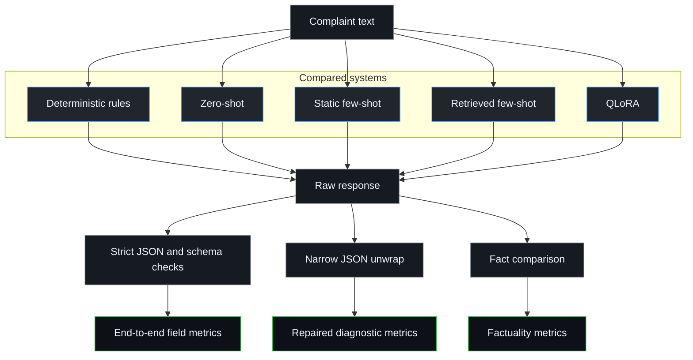

# CivicStruct

### Turning civic complaints into validated structured JSON

[Try the live demo](https://goyashek-civicstruct-grievance-demo.hf.space/) · [Read the final results](data/final_results/README.md) · [View the architecture](docs/architecture.svg)

CivicStruct asks a narrow question:

> Can a small language model turn an informal civic complaint into reliable
> structured data, and does QLoRA fine-tuning earn its complexity over rules
> and prompting?

The final QLoRA system was the strongest learned approach on the frozen
50-complaint test set. It reached 0.940 strict schema validity, 0.829 domain
F1, 0.745 issue F1, and 0.670 missing-information F1.

That result is useful, but incomplete. Deterministic rules still reached 0.883
domain F1, and QLoRA had a 0.365 exact factual-field mismatch rate. Valid JSON
does not automatically mean reliable fact extraction.

## At a glance

| item | result |
|---|---|
| task | civic complaint to validated JSON |
| base model | `HuggingFaceTB/SmolLM3-3B` |
| adaptation | 4-bit QLoRA |
| training data | 120 controlled and 40 deidentified public complaints |
| comparison | rules, zero-shot, static few-shot, retrieved few-shot, QLoRA |
| final evaluation | 50 frozen internal complaints |
| public review | Hugging Face Spaces demo |

## The task in one example

The input is ordinary complaint text:

> Bus 724 did not arrive near Nehru Place yesterday evening. I waited for
> almost an hour and do not know where to report it.

The target is a closed JSON schema:

```json
{
  "service_domain": "public_transport",
  "issue_type": "delay_or_non_arrival",
  "location": "near Nehru Place",
  "event_date_or_time": "yesterday evening",
  "amount_inr": null,
  "service_identifier": "bus 724",
  "urgency": "routine",
  "missing_information": ["exact_location"],
  "formal_summary": "Bus 724 did not arrive near Nehru Place yesterday evening, causing a wait of almost one hour."
}
```

The contract makes the task testable. Every output must use the agreed labels,
include the required keys, preserve stated facts, and produce a grounded formal
summary.

A response can fail before semantic scoring if it is not valid JSON. It can also
pass the schema while changing a location, dropping a service identifier, or
inventing a fact. CivicStruct measures those cases separately.

## Experiment design

Every system receives the same complaint and eventually meets the same schema
validator.



The five systems answer different questions:

| system | reason for including it |
|---|---|
| deterministic rules | tests how far obvious lexical cues can go without a language model |
| zero-shot | measures the untuned model with no examples |
| static few-shot | measures the value of three fixed audited demonstrations |
| retrieved few-shot | selects three training-only demonstrations with TF-IDF and unique case IDs |
| QLoRA | tests whether parameter-efficient training improves format and semantic extraction |

Static and retrieved prompting use the same demonstration count and roughly
the same prompt budget. QLoRA uses no demonstrations at inference, which cuts
its prompt length roughly in half. All model systems use greedy decoding.

## What changed while I built it

Four decisions shaped the final project. Each came from an early result that
made the original plan look weaker or less trustworthy.

<details>
<summary>I wrote the output contract first</summary>

The first smoke test used five fictional complaints. Qwen produced
JSON-shaped responses, but none passed the shared schema.

That made the order of work clear. I wrote the schema and annotation guide
before adding training code. The guide defines label boundaries, tie-breaking,
null handling, urgency, missing information, and the rule that formal summaries
must preserve the complaint's facts.

The schema remains in the Python standard library because the output is a flat
object and a larger validation dependency would add little.

</details>

<details>
<summary>I selected the base model before fine-tuning</summary>

I ran a 40-case development bake-off across Qwen3-4B, SmolLM3-3B, and
Phi-4-mini. Every zero-shot run failed strict schema validity, so I used fixed
few-shot prompting for the comparison.

| base model, fixed few-shot | schema valid | domain F1 | issue F1 | missing-info F1 | fact mismatch | peak T4 memory |
|---|---:|---:|---:|---:|---:|---:|
| Qwen3-4B | 0.175 | 0.268 | 0.200 | 0.302 | 0.176 | 5,771 MB |
| SmolLM3-3B | 0.425 | 0.483 | 0.221 | 0.563 | 0.056 | 2,668 MB |
| Phi-4-mini | 0.400 | 0.485 | 0.199 | 0.508 | 0.143 | 4,107 MB |

SmolLM3 had the best overall balance across schema validity, issue
classification, missing-information extraction, factual mismatch, and memory.
Phi was slightly better on domain F1, but not enough to outweigh the rest. I
selected SmolLM3 and did not fine-tune the full shortlist.

These development scores came from the earlier strict evaluator and were used
only for model selection. They are not final test claims.

</details>

<details>
<summary>I removed rows that inflated the dataset</summary>

An early version counted five controlled wording styles for every case and
reported 600 controlled training rows. Four styles were mechanical rewrites,
not independent complaints.

I removed them, reopened the earlier freeze, and kept one controlled surface
per canonical case. The corrected training pool contains 120 controlled and 40
manually corrected, deidentified public complaints.

I also discarded two automatic public-data drafts after review found street
details, unclear text, and incorrect labels. The separate 20-row San Diego
slice never enters training, retrieval, prompt design, or model selection.

</details>

<details>
<summary>I froze the study before opening the test set</summary>

Validation drove model choice, one training-length revision, and the final
configuration. I then saved the dataset hashes, model revision, prompts,
retriever, decoding settings, adapter settings, and evaluator in a frozen
manifest.

Only after that did the final notebook load the internal test and external
transfer files. The test predictions were generated once and did not trigger
another prompt, data, threshold, or model change.

</details>

## Data design

CivicStruct uses a controlled core for repeatable experiments and separate
public slices for transfer checks.

| split | rows | construction | role |
|---|---:|---|---|
| controlled training | 120 | one checked surface per fictional canonical case | QLoRA and retrieval |
| licensed public training | 40 | manually mapped and deidentified IChangeMyCity rows | QLoRA and retrieval |
| validation | 50 | formal and informal surfaces from 25 canonical cases | model and prompt choices |
| internal test | 50 | independently written fictional complaints | final controlled evaluation |
| external transfer | 20 | deidentified San Diego Get It Done rows | separate transfer check |
| supplemental San Diego benchmark | 240 | fresh deidentified rows | source-aligned stress test |

<details>
<summary>Split and leakage rules</summary>

The split unit is the canonical `case_id`, not the surface sentence. All
wording variants from one case stay in one split.

Retrieval indexes training rows only and selects at most one example from each
canonical case. Exact and cross-split near-duplicate checks run before freezing.

</details>

<details>
<summary>Coverage and label balance</summary>

The controlled cases cover all seven service domains, eight issue labels, and
three urgency levels.

Coverage is deliberate, but the labels are not forced into equal counts. Rare
labels remain rare, so their scores should not be treated as stable estimates.

</details>

<details>
<summary>Public data and privacy</summary>

I removed direct identifiers, request IDs, exact addresses, coordinates,
postcodes, and street-level fields from the public slices. Locations are
reduced to ward or community area.

The repository stores source-row hashes for traceability, not the raw public
downloads. Source URLs, licenses, transformations, hashes, and review counts
are recorded in the
[`public data manifest`](data/public_data_manifest.json).

The full data contract is in the
[`dataset card`](docs/dataset_card.md) and
[`annotation guide`](docs/annotation_guide.md). The frozen counts and file
hashes are in [`data/dataset_manifest.json`](data/dataset_manifest.json).

</details>

## QLoRA configuration

The final adapter is a reproducible training revision, not a broad
hyperparameter search.

| component | choice |
|---|---|
| base model | pinned `HuggingFaceTB/SmolLM3-3B` revision |
| quantization | 4-bit NF4 |
| trainable parameters | 30,228,480, about 1.78 percent |
| training rows | 160 |
| epochs | 2 |
| decoding | greedy, up to 256 new tokens |
| device | Kaggle Tesla T4 |

<details>
<summary>Full training recipe</summary>

Training uses completion-only loss so prompt tokens do not contribute to the
target loss.

| setting | value |
|---|---|
| base revision | `a07cc9a04f16550a088caea529712d1d335b0ac1` |
| training rows | 160 |
| epochs | 2 |
| LoRA rank and alpha | 16 and 32 |
| LoRA dropout | 0.05 |
| target modules | query, key, value, output, gate, up, and down projections |
| learning rate | `2e-4`, cosine schedule |
| effective batch | batch size 1 with 8 accumulation steps |
| maximum sequence length | 768 tokens |
| trainable parameters | 30,228,480, about 1.78 percent |
| decoding | greedy, up to 256 new tokens |
| seed | 42 |
| device | Kaggle Tesla T4 |

</details>

<details>
<summary>Measured run and validation revision</summary>

The two-epoch run took 327.3 seconds, reached a recorded training loss of
0.139, and peaked at about 1,586 MB of allocated GPU memory. The saved adapter
is about 121 MB.

A six-step smoke run first confirmed that the adapter could be trained, saved,
reloaded, and used for generation.

Training length increased from one epoch to two after the first full
validation run. Rank, alpha, learning rate, data, prompt, and decoding stayed
fixed.

| QLoRA validation run | schema valid | domain F1 | issue F1 | missing-info F1 | training seconds |
|---|---:|---:|---:|---:|---:|
| one epoch | 0.980 | 0.816 | 0.829 | 0.936 | 163.9 |
| two epochs | 1.000 | 0.964 | 0.908 | 0.977 | 327.3 |

</details>

## Evaluation contract

The primary score is strict end-to-end performance. If a response is invalid
JSON or fails schema version 1.0, every field receives zero for that row.

| evaluation view | purpose |
|---|---|
| strict | measures the complete complaint-to-JSON path |
| conditional | scores fields only for schema-valid outputs |
| repaired | unwraps one complete JSON object as a diagnostic |
| factuality | checks whether extracted facts match the complaint |

<details>
<summary>Field metrics</summary>

Service domain, issue type, and urgency use macro-F1 over the complete frozen
taxonomy, including labels with zero support in a bootstrap resample. Missing
information uses the same rule over all eight labels.

Location and time use normalized exact matching. Amount and service identifier
use exact matching.

</details>

<details>
<summary>Factuality metrics</summary>

The exact factual field mismatch rate checks location, time, amount, and service
identifier. It divides unsupported or mismatched predicted facts by all
non-null facts predicted by the system. The rate is `n/a` when no non-null facts
are predicted.

The factuality breakdown records correct, omitted, fabricated, distorted or
partly correct, and normalization-only cases by field.

</details>

<details>
<summary>Uncertainty estimates</summary>

Schema-validity and rubric pass rates use 95 percent Wilson intervals. Semantic
metrics use percentile bootstrap intervals from 2,000 row resamples with seed
42. Paired system differences use the same resampled complaint indices.

See the full [`evaluation contract`](docs/evaluation_contract.md).

</details>

## Final controlled test results

These are strict end-to-end results on 50 independently written complaints.
Parentheses contain 95 percent intervals.

| system | schema valid | domain F1 | issue F1 | missing-info F1 | fact mismatch |
|---|---|---|---|---|---|
| deterministic rules | 1.000 (0.929 to 1.000) | 0.883 (0.768 to 0.960) | 0.730 (0.598 to 0.819) | 0.010 (0.000 to 0.023) | n/a |
| zero-shot | 0.000 (0.000 to 0.071) | 0.000 (0.000 to 0.000) | 0.000 (0.000 to 0.000) | 0.000 (0.000 to 0.000) | n/a |
| static few-shot | 0.720 (0.583 to 0.825) | 0.522 (0.366 to 0.626) | 0.397 (0.268 to 0.496) | 0.219 (0.116 to 0.250) | 0.570 (0.471 to 0.670) |
| retrieved few-shot | 0.820 (0.692 to 0.902) | 0.638 (0.487 to 0.754) | 0.638 (0.495 to 0.733) | 0.348 (0.209 to 0.437) | 0.378 (0.267 to 0.490) |
| QLoRA | 0.940 (0.838 to 0.979) | 0.829 (0.697 to 0.914) | 0.745 (0.572 to 0.854) | 0.670 (0.364 to 0.723) | 0.365 (0.279 to 0.450) |

<details>
<summary>Best learned system</summary>

QLoRA leads the learned systems on schema validity, issue F1,
missing-information F1, and exact factual-field mismatch. It reaches 0.940
schema validity and 0.670 missing-information F1.

</details>

<details>
<summary>What rules still solve well</summary>

Rules reach 0.883 service-domain F1 and 1.000 schema validity. This shows that
the controlled benchmark contains strong lexical cues for routing.

Their missing-information F1 is only 0.011, and they emit no non-null facts.

</details>

<details>
<summary>Where prompting fails</summary>

Zero-shot produces no strictly valid responses. The narrow JSON unwrap recovers
40 of the 50 responses as a diagnostic, but repaired output is separate from
strict output.

Retrieved few-shot improves over static few-shot, but uses about twice the
prompt tokens of QLoRA.

</details>

<details>
<summary>What remains unresolved</summary>

QLoRA has a 0.365 exact factual-field mismatch rate. Under the evaluator, 46 of
126 predicted non-null facts do not match the gold value.

The model improves format reliability more than exact factual extraction. The
full result artifacts are in the
[`final results report`](data/final_results/README.md).

</details>

## External transfer results

The 20-row San Diego slice is reported separately from the controlled test. It
covers road, streetlight, drainage, and waste complaints from one civic system.
Its size limits broad transfer claims.

| system | schema valid | domain F1 | issue F1 | missing-info F1 | fact mismatch |
|---|---|---|---|---|---|
| deterministic rules | 1.000 (0.839 to 1.000) | 0.198 (0.108 to 0.261) | 0.163 (0.083 to 0.217) | 0.125 (0.125 to 0.125) | n/a |
| zero-shot | 0.000 (0.000 to 0.161) | 0.000 (0.000 to 0.000) | 0.000 (0.000 to 0.000) | 0.000 (0.000 to 0.000) | n/a |
| static few-shot | 0.950 (0.764 to 0.991) | 0.186 (0.131 to 0.250) | 0.090 (0.036 to 0.146) | 0.000 (0.000 to 0.000) | 0.947 (0.883 to 1.000) |
| retrieved few-shot | 0.950 (0.764 to 0.991) | 0.220 (0.134 to 0.280) | 0.116 (0.048 to 0.174) | 0.089 (0.065 to 0.107) | 0.250 (0.091 to 0.400) |
| QLoRA | 1.000 (0.839 to 1.000) | 0.233 (0.139 to 0.286) | 0.156 (0.070 to 0.236) | 0.125 (0.125 to 0.125) | 0.125 (0.000 to 0.286) |

<details>
<summary>What transferred</summary>

QLoRA performs best among the learned systems on this slice, especially on the
fact fields. It reaches 1.000 schema validity, 0.233 domain F1, 0.156 issue F1,
and 0.125 missing-information F1.

</details>

<details>
<summary>How to read the missing-information score</summary>

The 1.000 missing-information score needs context. Every external row has a
generalized location and the same `exact_location` omission.

This does not show broad missing-information reasoning across all eight labels.

</details>

<details>
<summary>Scope of this check</summary>

These rows come from one civic system and cover only a subset of the project
domains. The slice is a transfer check, not evidence for broad deployment
performance.

</details>

## Supplemental 240-row San Diego stress test

This is a larger source-aligned stress test, separate from the frozen 20-row
transfer evaluation.

The benchmark contains 240 fresh, deidentified San Diego descriptions:

| source category | rows |
|---|---:|
| street-light | 60 |
| sidewalk | 60 |
| pavement | 60 |
| illegal dumping | 60 |

The source provides a service category but does not provide full CivicStruct
gold labels.

| system | strict schema valid | mapped domain agreement, end to end | agreement among valid outputs |
|---|---:|---:|---:|
| QLoRA | 0.950 | 0.804 | 0.846 |

<details>
<summary>How to interpret this result</summary>

This measures format reliability and agreement with the source service
category. It does not evaluate issue type, urgency, missing information, or
summary faithfulness.

</details>

<details>
<summary>Relationship to Evaluation v2</summary>

This is a supplemental post-hoc benchmark. It does not change the frozen
20-row San Diego transfer results or the official Evaluation v2 comparison.

</details>

## Cross-city source-aligned diagnostic

| detail | value |
|---|---|
| source | Baton Rouge 311 API |
| rows | 60 safe comments |
| categories | garbage, recycling, drainage, sewer, road maintenance, street or traffic |
| label mapping | source category to broad CivicStruct service domain |
| role | supplemental source-aligned diagnostic |

| system | strict schema valid | service-domain agreement, end to end |
|---|---:|---:|
| deterministic rules | 1.000 | 0.150 |
| zero-shot | 0.000 | 0.000 |
| static few-shot | 0.967 | 0.367 |
| retrieved few-shot | 0.933 | 0.350 |
| QLoRA | 0.983 | 0.500 |

<details>
<summary>Interpretation</summary>

QLoRA produced 59 valid records and matched the mapped source category on 30 of
60 rows. It preserved the output format better than it transferred the
service-domain labels.

The source rows do not provide full gold labels, so this is not a full
Evaluation v2 comparison.

</details>

## Data-size ablation

The ablation keeps the two-epoch recipe fixed and changes only the number of
training rows. Subsets are selected by canonical case group.

| training rows | validation schema | domain F1 | issue F1 | missing-info F1 | loss | seconds |
|---:|---:|---:|---:|---:|---:|---:|
| 40 | 0.980 | 0.659 | 0.856 | 0.531 | 0.269 | 85.9 |
| 80 | 0.980 | 0.692 | 0.843 | 0.936 | 0.186 | 171.2 |
| 160 | 1.000 | 0.964 | 0.908 | 0.977 | 0.139 | 327.3 |

<details>
<summary>What improved with more data</summary>

Missing-information F1 benefits most from additional examples. Schema validity
also reaches 1.000 at 160 training rows.

</details>

<details>
<summary>How to read this ablation</summary>

Issue F1 is not monotonic between 40 and 80 rows. This is one run per size, not
a repeated learning-curve study, so the results show a trend rather than a
stable estimate of data scaling.

</details>

## Summary rubric pass

The review sampled ten internal complaints with seed 42. Every system was
scored on the same complaints, with system names hidden and the 50
complaint-summary pairs shuffled before scoring.

| system | factuality | completeness | both pass |
|---|---:|---:|---:|
| deterministic rules | 10/10 | 10/10 | 10/10 |
| zero-shot | 9/10 | 10/10 | 9/10 |
| static few-shot | 10/10 | 10/10 | 10/10 |
| retrieved few-shot | 10/10 | 10/10 | 10/10 |
| QLoRA | 10/10 | 10/10 | 10/10 |
| overall | 49/50 | 50/50 | 49/50 |

<details>
<summary>Review criteria</summary>

Factuality required no unsupported or contradictory fact. Completeness required
the core issue and material facts to remain.

</details>

<details>
<summary>What failed</summary>

The only failed judgment was a zero-shot summary that changed intermittent low
pressure into a service outage.

</details>

<details>
<summary>How to interpret the review</summary>

This is a single-reviewer qualitative check on ten complaints. It has no
inter-rater reliability statistic and should not be read as a 98 percent
population estimate of summary quality.

</details>

## What I learned

The project changed my view of the task in five ways:

1. Valid JSON is a model-quality metric, not a formatting detail.
2. Rules remain useful when the benchmark contains strong lexical cues.
3. Retrieval and fine-tuning solve different failure modes.
4. Independent examples matter more than repeated wording styles.
5. A held-out test can change the story even when validation looks strong.

<details>
<summary>Evidence behind these lessons</summary>

Zero-shot SmolLM3 often wrapped useful JSON in extra text. Rules reached 0.883
domain F1 but only 0.011 missing-information F1. QLoRA and retrieval had
overlapping factual-mismatch intervals on the final test.

Removing 480 mechanical rewrites made the dataset smaller but more defensible.
The selected adapter reached 0.977 missing-information F1 on validation and
0.670 on the internal test.

</details>

## Reproducing the saved results

The results-only path uses the Python standard library and does not require the
local adapter archive.

```bash
python3 -m pip install -r requirements.txt
python3 -m unittest discover -s tests -v
python3 -m src.report_validation
python3 -m src.report_final
```

The final report recomputes all ten saved system runs, checks them against the
stored scores, and rebuilds `data/final_results/final_metrics.json`.

<details>
<summary>Integrity and MLOps checks</summary>

```bash
python3 -m pip install -r requirements-mlops.txt
dvc repro
MLFLOW_ALLOW_FILE_STORE=true mlflow ui --backend-store-uri data/reproducibility_results/mlruns
```

`dvc.lock` records the frozen report inputs. The MLflow store contains a
metadata backfill run labeled as reconstructed after the frozen run.

```bash
python3 src/check_canonical_cases.py
python3 src/check_surface_variants.py
python3 src/check_public_data.py
python3 src/check_test_cases.py
python3 src/check_dataset_freeze.py
```

</details>

<details>
<summary>GPU notebooks, archives, and MLflow stores</summary>

The GPU workflow stays visible in notebooks rather than behind a training CLI.
[`final_kaggle_run.ipynb`](notebooks/final_kaggle_run.ipynb) contains its own
install cell, fetches the pinned repository inputs, trains the revision and
ablations, freezes the system, and only then loads held-out data. The untouched
executed copy is
[`final_kaggle_run_executed.ipynb`](notebooks/final_kaggle_run_executed.ipynb).

The cross-city handoff is
[`final_kaggle_external_validation.ipynb`](notebooks/final_kaggle_external_validation.ipynb),
with its executed copy in
[`final_kaggle_external_validation_executed.ipynb`](notebooks/final_kaggle_external_validation_executed.ipynb).
It reruns the frozen final recipe and then performs the separate Baton Rouge
source-aligned diagnostic with Kaggle Internet enabled.

The full Kaggle ZIPs contain the roughly 121 MB adapter and remain ignored by
Git because of GitHub's 100 MB file limit. Their SHA-256 hashes are:

```text
civicstruct_final_results_kaggle.zip
85f42be61bde8235a4c6d133c825685a15359b2110afcf30dd68aafcdf285527
civicstruct_final_external_validation.zip
771d2859cad977677a55ef4367dad81e2cd6fdb482887dd7c6a058a3a054df36
```

The two saved development MLflow stores can also be opened with:

```bash
MLFLOW_ALLOW_FILE_STORE=true mlflow ui --backend-store-uri data/model_selection_results/mlruns
MLFLOW_ALLOW_FILE_STORE=true mlflow ui --backend-store-uri data/validation_results/mlruns
```

</details>

## Local and hosted review demo

[Try the hosted demo](https://goyashek-civicstruct-grievance-demo.hf.space/)

| review path | status |
|---|---|
| hosted Gradio demo | live on free ZeroGPU |
| local Gradio app | available with the local adapter |
| shared inference | reused by Gradio, CLI, and FastAPI |
| architecture | [`docs/architecture.svg`](docs/architecture.svg) |


<details>
<summary>Local command</summary>

The local Gradio app reuses the same frozen inference module as the CLI and
FastAPI service.

```bash
python3 -m pip install -r requirements-training.txt
python3 -m pip install -r requirements-demo.txt
python3 -m src.demo
```

Use fictional text while reviewing. The app shows a visible load failure when
the local adapter is unavailable.

</details>

<details>
<summary>Hosted latency</summary>

Model generation took about 4.51 seconds in one checked request. End-to-end
calls took 7.02 and 16.07 seconds because the 3B weights may reload between
requests.

</details>

## Repository map

```text
data and contracts
├── data/
├── docs/
└── dvc.yaml, dvc.lock

experiments
└── notebooks/
    ├── model_basics.ipynb
    ├── model_bakeoff.ipynb
    ├── validation_qlora.ipynb
    ├── final_kaggle_run.ipynb
    └── external-validation notebooks

evaluation and reports
└── src/
    ├── schema.py
    ├── evaluate.py
    ├── report_validation.py
    ├── report_final.py
    └── model_registry.py

serving
└── src/
    ├── inference.py
    ├── cli.py
    ├── api.py
    └── demo.py

deployment
├── Dockerfile
├── deploy/huggingface_space/
└── requirements-*.txt
```

The main saved artifacts are:

- [`data/validation_results/`](data/validation_results/README.md)
- [`data/final_results/`](data/final_results/README.md)
- [`data/model_selection_results/`](data/model_selection_results/README.md)
- [`docs/release_checklist.md`](docs/release_checklist.md)

## Limitations

> CivicStruct is an evaluation project and review tool, not an autonomous
> grievance-routing system.

The main limits are:

1. The controlled benchmark is synthetic and cleaner than ordinary complaint
   text.
2. The public training set has 40 rows from four domains.
3. The external transfer set has 20 rows from one civic system.
4. Public labels are manual project mappings.
5. Confidence intervals are wide because the study uses few runs and one
   summary reviewer.

<details>
<summary>Before using the model</summary>

QLoRA can produce valid JSON while changing extracted facts. Downstream
validation and human review are required before routing or submitting a
complaint.

Roman-script Hinglish has limited coverage. The project does not provide legal
advice, choose the final department, or replace a caseworker.

</details>

## Project status

> Research complete. Evaluation v2 and serving configuration frozen.

Preserved in the repository:

- frozen datasets and predictions
- model bake-off and QLoRA runs
- ablation and transfer checks
- confidence intervals and summary review
- notebooks, reports, and MLflow records
- local and hosted inference paths

See [`docs/release_checklist.md`](docs/release_checklist.md) for the final
claim-to-artifact checks.
